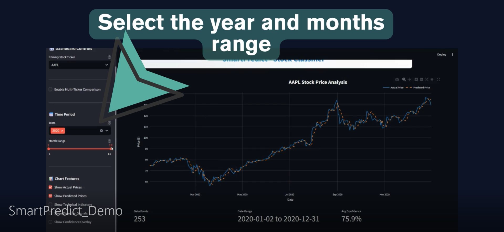

# SmartPredict: Financial Forecasting for Competitive Trading - Team Project

## Project Overview

SmartPredict is a financial forecasting project aimed at helping **Move Tickers** provide smarter, data-driven trading recommendations to its customers. By leveraging machine learning and real-time financial datasets, our system predicts short-term price movements in NASDAQ-100 stocks, enabling more informed and competitive trading strategies.

The project culminates in an **interactive dashboard** that visualizes stock price predictions, market indicators, and key financial metrics in a format accessible even to users with basic financial literacy.

---

## Problem Statement

The stock market is inherently risky, and customers of firms like Move Tickers need accurate tools to navigate this complexity. Researching financial data manually is time-consuming and error-prone. Our solution offers:
- **Price movement predictions**
- **Earnings-based stock behavior analysis**
- **A clean dashboard UI for fast decision-making**

By combining AI predictions with UI design, we aim to give Move Tickers a real-time, interpretable edge in competitive trading.

---

## Data Sources

We primarily used engineered time-series features for each stock, such as moving averages, volatility, and earnings surprise indicators. Below is a summary of our key datasets:

| Dataset                   | Source                  | Features Used                                                                                                                                           | Use Case                                   |
|---------------------------|-------------------------|----------------------------------------------------------------------------------------------------------------------------------------------------------|--------------------------------------------|
| NASDAQ-100 Daily Data     | Move Tickers Database   | `date`, `ticker`, `close_lag`, `close_mean_10_days`, `close_std_10_days`, `close_max_10_days`, `ema_close_10_days`, `bb_upper_20`, `bb_lower_20`, etc. | Long-term trend analysis                   |
| NASDAQ-100 Minute Data    | Move Tickers Database   | `timestamp`, `ticker`, short-term OHLC indicators                                                                                                        | Short-term/intraday price behavior         |
| NASDAQ-100 Index Data     | Move Tickers Database   | `date`, `index_value`, `volume`                                                                                                                          | Overall market momentum context            |
| Macroeconomic Indicators  | Move Tickers Database   | `interest_rate`, `CPI`, `VIX`                                                                                                                            | Captures market sentiment and risk factors |
| EPS Reports               | Yahoo Finance           | `eps_estimate`, `eps_actual`, `eps_surprise`, `surprise_percent`                                                                                        | Event-driven stock behavior analysis       |
---

## 💻 Dashboard

The final deliverable is an interactive Streamlit dashboard that enables users to:

- Predict stock price direction (up/down) using a classification model  
- Estimate future closing prices using a regression model  
- Analyze company-level features like earnings surprises, Bollinger Bands, moving averages, and volatility  
- Explore macroeconomic context through indicators such as interest rates, inflation, and market volatility  
- Visualize model confidence using predicted probabilities  
- Compare actual vs predicted prices across time  
- Forecast future behavior based on the latest available feature vector  
- Select company and year dynamically, filter by date, and choose chart display options
---

##  Dashboard Usage Guide

The **SmartPredict Dashboard** provides an intuitive interface to explore stock predictions and analyze financial patterns interactively. Below is an overview of its key features and how to use them effectively.

### What’s in the Dashboard?

 

**Dashboard Components:**

- **Primary Stock Ticker Dropdown**  
  Select NASDAQ-100 stock (e.g., AAPL, GOOG) to view its prediction and performance.

- **Enable Multi-Ticker Comparison (Optional)**  
  Toggle this to compare multiple stock predictions side by side.

- **Time Period Selector**  
  Choose the year (e.g., 2020) and month range (e.g., Jan–Dec) for which to analyze stock trends.

- **Chart Features**  
  - Show Actual Prices: Displays real stock prices from the selected period.  
  - Show Predicted Prices: Visualizes the model's predicted prices alongside actual data.  
  - Technical Indicators: Optionally display metrics like direction signals, confidence overlay
- 
- **Main Chart: Stock Price Analysis**  
  An interactive line chart showing:  
  - **Actual Price** (blue solid line)  
  - **Predicted Price** (orange dashed line)  
  This enables quick comparison between real-world data and model performance.

- **Tooltip for Help**  
  A help button on the top right provides tooltips about using the dashboard and its purpose.

---

###  How to Use It

1. **Start by selecting a stock** from the dropdown menu (e.g., AAPL).


1. **Choose a year and month range** using the sliders to focus your analysis on a specific time window.

1. **Toggle chart options** to customize your view (e.g., enable/disable technical indicators or predicted prices).

1. **Interpret the Chart**:  
   - If the predicted line closely follows the actual price, the model has high accuracy.  
   - Use deviations to understand where the model might over/underestimate trends.
2. **Use the prediction for decision-making**: Combine with earnings and macro indicators for trading insights.

This dashboard bridges machine learning insights with user-friendly visuals to support data-backed investment strategies.

---


### Technologies Used:

- `streamlit` for UI and interactivity  
- `altair` for plotting actual vs predicted trends  
- `joblib` to load trained models  
- `scikit-learn` and `xgboost` for prediction logic  
- `pandas`, `numpy` for data manipulation

Example: Select a company like `GOOG`, choose a forecast date, and see both direction and price predictions for the next 5 trading days — along with classification probabilities and model accuracy.

## How to Run the Project Locally

This guide walks you through setting up and running the project locally using [Poetry](https://python-poetry.org/) and optionally Docker.

---
## How to Run

### Prerequisites

- **Python** ≥ `3.9`
- **Poetry** ≥ `2.1.3`
- [Docker](https://docs.docker.com/get-docker/) installed (optional, for containerization)
---

### Install Poetry

If Poetry is not installed, run:

```bash
curl -sSL https://install.python-poetry.org | python3 -
```

### 1. Clone the Repository

First, clone the repository to your local machine:

```bash
git clone (https://github.com/zpilitowska1/stocks-predictor/tree/main)
cd streamlit_dashboard
``` 

### 2. Install Dependencies

poetry install

### 3. Run the App (Locally with Poetry)

poetry shell
streamlit run fixed_dashboard.py


### 4. Exit the environment

exit

###  Docker Instructions
```bash
docker build -t streamlit-dashboard .
docker run -p 8501:8501 streamlit-dashboard
```
